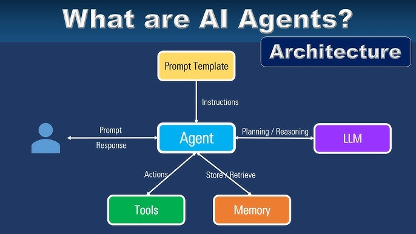

# Agentic AI:
        
## Genrative AI -> create Content -> LLM Model

       Sell Query,Prompt -> Large Language Model -> O/P
        Generate Content

## Agentic AI :
       
                Autonomous AI system with a Goal -> Business Outcome
                Tools : DuckDuckGoSearch
//
Complex Workflow
fine-tuning of LLMS for better performance

      1000$
      Buy Some Stocks   -> LLM Custom Box -> Finance News -> ytfinance  
                                                              -> Current News  
      Sell in 5days       
             

What are AI Agents?  

Ans:- An artificial intelligence (AI) agent is a software program that can interact with its environment, collect data, and use the data to perform self-determined tasks to meet predetermined goals. Humans set goals, but an AI agent independently chooses the best actions it needs to perform to achieve those goals. For example, consider a contact center AI agent that wants to resolves customer queries. The agent will automatically ask the customer different questions, look up information in internal documents, and respond with a solution. Based on the customer responses, it determines if it can resolve the query itself or pass it on to a human.    

The LLM can perform task on my behalf. 

